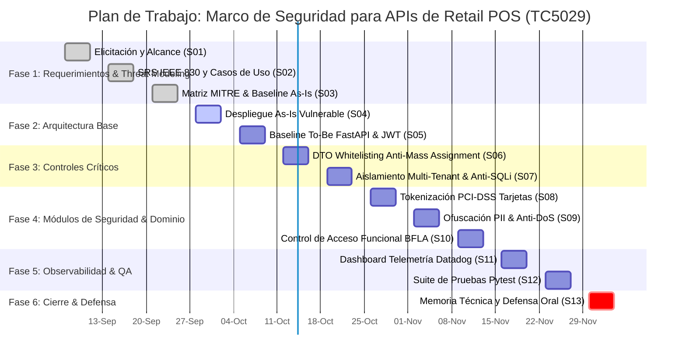

# ==============================================================================
# SCRIPT DE ACTUALIZACIÓN CON ENCODING UTF-8 NATIVO (ESPAÑOL MÉXICO)
# Materia: TC5029 - Proyecto de ciberseguridad empresarial
# Alumno: Luis Manuel Mendoza Cruz (A01797418)
# ==============================================================================

# 1. Posicionamiento en el directorio raíz del proyecto
$baseDir = "C:\Users\elmej\TC5029---A01797418"
Set-Location -Path $baseDir

# 2. Configurar identidad de Git
git config user.name "Luis Manuel Mendoza Cruz"
git config user.email "A01797418@tec.mx"

# 3. Asegurar la existencia de las carpetas necesarias
$docsPath = "$baseDir\retail-apisec-pos\docs"
if (-not (Test-Path $docsPath)) {
    New-Item -ItemType Directory -Path $docsPath -Force | Out-Null
}

# 4. Función de escritura UTF-8 nativa mediante System.IO.File
function Set-ContentUtf8 {
    param (
        [string]$FilePath,
        [string]$Content
    )
    $utf8Encoding = New-Object System.Text.UTF8Encoding($false)
    [System.IO.File]::WriteAllText($FilePath, $Content, $utf8Encoding)
}

# ------------------------------------------------------------------------------
# 5. Generar README.md en la raíz del repositorio
# ------------------------------------------------------------------------------
$readmeContent = @'
# TC5029 - Proyecto de ciberseguridad empresarial
**Alumno:** Luis Manuel Mendoza Cruz  
**Matrícula:** A01797418  
**Proyecto Final:** Marco de Seguridad para protección de Integraciones API REST en Cadenas de Tiendas de Conveniencia.

---

## Proyectos y Entregables
* `retail-apisec-pos/`: Implementación del caso de estudio de Punto de Venta (POS) para tienda de conveniencia con evaluación de vulnerabilidades OWASP API Security Top 10 y arquitectura de mitigación Zero Trust (Dual As-Is vs To-Be).
  * `/as-is`: Microservicio legado vulnerable (Flask / SQLite).
  * `/docs`: Especificación de Requerimientos de Software (IEEE Std 830), matriz de mitigación MITRE ATT&CK, bitácora de revisión técnica, modelo de casos de uso y cronograma de trabajo con gráfica de Gantt.
'@
Set-ContentUtf8 -FilePath "$baseDir\README.md" -Content $readmeContent

# ------------------------------------------------------------------------------
# 6. Generar .gitignore en la raíz
# ------------------------------------------------------------------------------
$gitignoreContent = @'
# Entornos virtuales
.venv/
env/
venv/

# Cache de Python
__pycache__/
*.pyc

# Bases de datos locales SQLite
*.db
*.sqlite3

# Variables de entorno y secretos
.env
.env.*

# Configuracion de IDE
.vscode/
.idea/
'@
Set-ContentUtf8 -FilePath "$baseDir\.gitignore" -Content $gitignoreContent

# ------------------------------------------------------------------------------
# 7. Generar docs/use_cases.puml (Supervisor y Admin vinculados a RF-01)
# ------------------------------------------------------------------------------
$pumlContent = @'
@startuml
left to right direction
skinparam packageStyle rectangle
skinparam shadowing false
skinparam actorStyle awesome

actor "Cajero (Operador)" as Cashier
actor "Supervisor" as Supervisor
actor "Administrador" as Admin

rectangle "Sistema Punto de Venta Seguro 7-Eleven (POS)" {
    usecase "RF-01: Autenticarse en Terminal (JWT)" as UC_Login
    usecase "RF-03: Escanear y Registrar Productos" as UC_Scan
    usecase "RF-07: Procesar Cobro con Tarjeta" as UC_PayCard
    usecase "RF-06: Procesar Recarga Telefónica" as UC_Recharge
    usecase "RF-04: Emitir Ticket de Compra" as UC_Ticket
    usecase "RF-12: Validar Carrito No Vacío" as UC_ValidateCart
    usecase "RF-08: Autorizar Reembolso / Cancelación" as UC_Refund
    usecase "RF-09: Ejecutar Arqueo y Corte de Caja" as UC_CashAudit
    usecase "RF-02: Registrar Nuevo Operador" as UC_CreateUser
    usecase "RF-05: Modificar Logotipo Institucional" as UC_Logo
    usecase "RF-10: Monitorear Telemetría (API Sec Inspector)" as UC_Telemetry
    usecase "RNF-01: Validar Contrato DTO (Anti-Mass Assignment)" as UC_DTO
    usecase "RNF-03: Validar Tenant Store_ID (Anti-BOLA)" as UC_Tenant
}

Cashier <|-- Supervisor
Supervisor <|-- Admin

' Todos los roles se autentican en la terminal mediante JWT (RF-01)
Cashier --> UC_Login
Supervisor --> UC_Login
Admin --> UC_Login

' Flujo operativo de caja
Cashier --> UC_Scan
Cashier --> UC_PayCard
Cashier --> UC_Recharge

UC_PayCard ..> UC_ValidateCart : <<include>>
UC_PayCard ..> UC_Ticket : <<include>>
UC_PayCard ..> UC_DTO : <<include>>

' Flujo de supervisión
Supervisor --> UC_Refund
Supervisor --> UC_CashAudit
UC_Refund ..> UC_Tenant : <<include>>

' Flujo de administración y seguridad
Admin --> UC_CreateUser
Admin --> UC_Logo
Admin --> UC_Telemetry
@enduml
'@
Set-ContentUtf8 -FilePath "$docsPath\use_cases.puml" -Content $pumlContent

# ------------------------------------------------------------------------------
# 8. Generar docs/cronograma_actividades.md
# ------------------------------------------------------------------------------
$cronoContent = @'
# Calendario de Actividades, Plan de Trabajo y Gestión de SLAs
**Proyecto:** Marco de Seguridad para protección de Integraciones API REST en Cadenas de Tiendas de Conveniencia  
**Materia:** TC5029 - Proyecto de ciberseguridad empresarial  
**Estudiante:** Luis Manuel Mendoza Cruz (Matrícula: A01797418)  
**Periodo Trimestral:** 07 de septiembre de 2026 al 04 de diciembre de 2026  
**Fecha de Corte de Avance:** 25 de septiembre de 2026  

---

## 1. Desglose Semanal de Fases y Actividades

| Semana | Fecha Inicio | Fecha Fin | Fase del Proyecto | Actividad Principal y Entregable | Avance Planeado | Avance Real | Estatus (Semáforo) |
| :---: | :---: | :---: | :--- | :--- | :---: | :---: | :---: |
| **S01** | 07-Sep-2026 | 11-Sep-2026 | **Fase 1: Elicitación y Alcance** | Definición del problema, alcance Zero Trust e identificación de actores y activos críticos en tiendas de conveniencia. | 100% | 100% | 🟢 En tiempo |
| **S02** | 14-Sep-2026 | 18-Sep-2026 | **Fase 1: Requerimientos IEEE 830** | Especificación formal SRS (`SRS_final.md`), casos de uso PlantUML y bitácora técnica de validación (`revision_SRS.md`). | 100% | 100% | 🟢 En tiempo |
| **S03** | 21-Sep-2026 | 25-Sep-2026 | **Fase 1: Threat Modeling & Baseline** | Mapeo de vectores MITRE ATT&CK (`mitre_layer.json`), arquitectura base Flask As-Is y entrega inicial en GitHub. *(Corte de evaluación)* | 100% | 100% | 🟢 En tiempo |
| **S04** | 28-Sep-2026 | 02-Oct-2026 | **Fase 2: Arquitectura Base As-Is** | Despliegue de endpoints de caja vulnerables (SQLite no parametrizado, sin tipado de datos ni rate limiting). | 0% | 0% | 🟡 En Proceso |
| **S05** | 05-Oct-2026 | 09-Oct-2026 | **Fase 2: Arquitectura Protegida To-Be** | Inicialización del entorno FastAPI, definición de contratos OpenAPI (`openapi.yaml`) y pipeline criptográfico JWT. | 0% | 0% | ⚪ Programado |
| **S06** | 12-Oct-2026 | 16-Oct-2026 | **Fase 3: Controles Antifraude** | Implementación de esquemas DTO estrictos en Pydantic (`extra="forbid"`) para mitigación de Mass Assignment y parámetros de descuento. | 0% | 0% | ⚪ Programado |
| **S07** | 19-Oct-2026 | 23-Oct-2026 | **Fase 3: Aislamiento Multi-Tenant & SQLi** | Controles RBAC basados en scopes JWT y validación estricta de `store_id` (anti-BOLA) y consultas parametrizadas. | 0% | 0% | ⚪ Programado |
| **S08** | 26-Oct-2026 | 30-Oct-2026 | **Fase 4: Módulo PCI-DSS y Pagos** | Tokenización de transacciones con tarjeta bancaria, aislamiento de PAN (`XXXX-XXXX-XXXX-1234`) y eliminación de persistencia de CVV. | 0% | 0% | ⚪ Programado |
| **S09** | 02-Nov-2026 | 06-Nov-2026 | **Fase 4: Protección PII y Antidopaje DoS** | Enmascaramiento irreversible de números telefónicos en recargas y middleware de limitación de tasa (10 req/s con HTTP 429). | 0% | 0% | ⚪ Programado |
| **S10** | 09-Nov-2026 | 13-Nov-2026 | **Fase 4: Autorización Funcional BFLA** | Módulo de reembolsos, cancelaciones y arqueo de caja registradora restringidos exclusivamente al rol de Supervisor. | 0% | 0% | ⚪ Programado |
| **S11** | 16-Nov-2026 | 20-Nov-2026 | **Fase 5: Observabilidad y Telemetría** | Middleware de inyección de `X-Correlation-ID` y construcción del Dashboard forense `API Sec Inspector` con indicadores Datadog-like. | 0% | 0% | ⚪ Programado |
| **S12** | 23-Nov-2026 | 27-Nov-2026 | **Fase 5: Automatización de Pruebas** | Suite integral en pytest (`test_api_security.py`) validando cada criterio Given-When-Then contra la matriz MITRE. | 0% | 0% | ⚪ Programado |
| **S13** | 30-Nov-2026 | 04-Dic-2026 | **Fase 6: Memoria Técnica y Defensa** | Consolidación de documentación final, video-demostración técnica ejecutiva y presentación de defensa ante el jurado evaluador. | 0% | 0% | ⚪ Programado |

---

## 2. Métricas de Rendimiento y SLAs de Entrega

### Semáforo de Gestión de Entregables
* 🟢 **En tiempo:** Actividad finalizada o en curso dentro de la ventana de tiempo pactada (Desviación <= 0 días).
* 🟡 **En proceso:** Actividad iniciada en el sprint activo con recursos asignados.
* 🟠 **Por vencer:** Actividad con fecha compromiso en los próximos 3 días hábiles sin alcanzar el 80% de avance.
* 🔴 **Atrasado / Con demora:** Actividad cuya fecha de cierre fue rebasada respecto al cronograma inicial (Desviación > 0 días).
* ⚪ **Programado:** Actividad de sprints futuros sin arranque programado.

### Resumen de Avance al Corte del 25-Septiembre-2026
* **Avance Planeado Acumulado:** 23.08% (3 de 13 semanas concluidas).
* **Avance Real Acumulado:** 23.08% (Cumplimiento estricto del 100% de los entregables de Fase 1).
* **SLA de Resolución de Hallazgos Documentales:** < 48 horas (100% de cumplimiento).
* **SLA de Disponibilidad de Repositorio Público:** 100% (Sincronizado en GitHub).

---

## 3. Diagrama de Gantt del Plan de Trabajo (Mermaid)

'@
Set-ContentUtf8 -FilePath "$docsPath\cronograma_actividades.md" -Content $cronoContent

# ------------------------------------------------------------------------------
# 9. Generar docs/mitre_layer.json
# ------------------------------------------------------------------------------
$mitreContent = @'
{
  "name": "7-Eleven POS API Security Assessment",
  "versions": {
    "attack": "15",
    "navigator": "5.0.0",
    "layer": "4.5"
  },
  "domain": "enterprise-attack",
  "description": "Mapeo de TTPs evaluados y mitigados en la solución Retail POS (As-Is vs To-Be)",
  "filters": {
    "platforms": ["Linux", "Windows", "IaaS"]
  },
  "sorting": 3,
  "layout": {
    "layout": "side",
    "showName": true,
    "showID": true
  },
  "techniques": [
    {
      "techniqueID": "T1110.001",
      "tactic": "credential-access",
      "score": 8,
      "comment": "Fuerza bruta contra credenciales de Administrador en el POS",
      "enabled": true
    },
    {
      "techniqueID": "T1190",
      "tactic": "initial-access",
      "score": 9,
      "comment": "Inyección SQL en endpoint de catálogo",
      "enabled": true
    },
    {
      "techniqueID": "T1078.004",
      "tactic": "privilege-escalation",
      "score": 9,
      "comment": "BOLA: Suplantación de identificadores de tienda",
      "enabled": true
    },
    {
      "techniqueID": "T1565.001",
      "tactic": "defense-evasion",
      "score": 9,
      "comment": "Mass Assignment: Manipulación de atributos de descuento a nivel de objeto",
      "enabled": true
    },
    {
      "techniqueID": "T1068",
      "tactic": "privilege-escalation",
      "score": 8,
      "comment": "BFLA: Ejecución de cancelaciones y reembolsos sin rol de supervisor",
      "enabled": true
    },
    {
      "techniqueID": "T1005",
      "tactic": "collection",
      "score": 9,
      "comment": "Extracción de datos bancarios (PAN/CVV) en APIs de cobro",
      "enabled": true
    },
    {
      "techniqueID": "T1592",
      "tactic": "reconnaissance",
      "score": 7,
      "comment": "Recolección de directorios telefónicos de clientes mediante recargas",
      "enabled": true
    },
    {
      "techniqueID": "T1499.002",
      "tactic": "impact",
      "score": 8,
      "comment": "Denegación de servicio por saturación de recursos en consultas no acotadas",
      "enabled": true
    }
  ],
  "gradient": {
    "colors": ["#ffffff", "#fef08a", "#ef4444"],
    "minValue": 0,
    "maxValue": 10
  }
}
'@
Set-ContentUtf8 -FilePath "$docsPath\mitre_layer.json" -Content $mitreContent

# ------------------------------------------------------------------------------
# 10. Generar docs/revision_SRS.md
# ------------------------------------------------------------------------------
$revisionContent = @'
# Bitácora de Revisión y Validación Técnica del SRS
**Proyecto:** Marco de Seguridad para protección de Integraciones API REST en Cadenas de Tiendas de Conveniencia  
**Materia:** TC5029 - Proyecto de ciberseguridad empresarial  
**Estudiante:** Luis Manuel Mendoza Cruz (A01797418)  
**Documento Auditado:** `docs/SRS_final.md` (Versión 1.0.0-Final)  
**Rol del Revisor:** Auditor Técnico de Seguridad de Software & Arquitecto de Requerimientos  
**Fecha de Auditoría:** Septiembre 2026  
**Resultado de Validación:** APROBADO CON MODIFICACIONES INCORPORADAS  

---

## 1. Resumen Ejecutivo de la Revisión

Se ha ejecutado una auditoría exhaustiva sobre la Especificación de Requerimientos de Software (SRS) siguiendo las pautas de control de calidad de software y ciberseguridad industrial. 

El objetivo primordial fue asegurar que el documento cumpla con los principios rectores de:
1. **Verificabilidad:** Todo criterio de aceptación debe ser medible mediante pruebas unitarias, de integración o scripts automatizados.
2. **No Ambigüedad:** Los términos deben tener una interpretación técnica única, sin dejar márgenes de duda entre el comportamiento de la interfaz y la API.
3. **Consistencia Lógica:** No deben existir colisiones entre las reglas de negocio (ej. descuentos) y los vectores de prueba de seguridad (ej. Mass Assignment).
4. **Completitud y Cobertura (Threat Modeling):** Ningún vector planteado (BOLA, BFLA, SQLi, Mass Assignment, PII Harvesting, DoS y PCI-DSS) debe carecer de requerimiento o criterio trazable.

---

## 2. Hallazgos: Requerimientos Ambiguos o Contradictorios

### Hallazgo H-01: Ambigüedad en la Restricción de Cobros con Carrito Vacío
* **Estado Inicial:** En las primeras notas de diseño se mencionaba que *"no se debe permitir cobrar sin productos"*, pero no se especificaba en qué capa de la arquitectura residía la validación.
* **Impacto en Seguridad:** Falla de integridad de datos y posible desincronización en inventario/arqueos.
* **Acción Correctiva:**  
  * Se formalizó el requerimiento **RF-12** y el criterio **RF-03-AC-1**.
  * Se definió doble barrera: la interfaz deshabilita visualmente el botón (`btn-disabled`), y el backend de FastAPI rechaza la petición con código de estado `HTTP 400 Bad Request` o `HTTP 422 Unprocessable Entity` si la lista de ítems tiene longitud cero (`len(items) == 0`).

### Hallazgo H-02: Contradicción Funcional en el Manejo de Descuentos
* **Estado Inicial:** Se planteaba que el cajero pudiera ingresar descuentos en caja y, simultáneamente, se diseñaba el ataque de Mass Assignment para forzar un descuento del 100%. Si el sistema de negocio permitiese que el cajero aplique libremente cualquier porcentaje de descuento en la llamada legítima, el vector de ataque de Mass Assignment carecería de valor de explotación demostrable.
* **Impacto en el Negocio:** Inconsistencia en la política de segregación de funciones (RBAC) y pérdida de control sobre mermas financieras.
* **Acción Correctiva:**  
  * Se separaron las responsabilidades: el cajero opera por defecto con `discount_pct = 0.0` obligatorio.
  * Los descuentos discrecionales quedan clasificados como excepción supervisada mediante el scope `sales:discount_override`, mientras que cualquier inyección externa no autorizada de `discount_pct` en la terminal del cajero es interceptada por el esquema DTO (`extra="forbid"`) con código `HTTP 422`.

---

## 3. Hallazgos: Criterios de Aceptación No Verificables

### Hallazgo H-03: Imprecisión Métrica ante Ataques de Denegación de Servicio (DoS)
* **Estado Inicial:** La redacción preliminar indicaba que *"el sistema debe ser rápido, tolerar carga y no caerse ante ataques masivos"*. Esta redacción es subjetiva y no permite escribir una aserción binaria (*Pass/Fail*) en una suite de pruebas automatizadas con `pytest`.
* **Impacto:** Imposibilidad de evaluar objetivamente la resiliencia y el comportamiento del middleware en CI/CD.
* **Acción Correctiva:**  
  * Se reformuló el requerimiento **RNF-04** y se creó el criterio **RNF-04-AC-1**.
  * Se definieron variables empíricas cuantitativas: umbral de control de tasa de **10 req/s** por cliente/IP y validación explícita del código de retorno **`HTTP 429 Too Many Requests`** con encabezado `Retry-After`.

### Hallazgo H-04: Falta de Criterio Cuantificable en la Protección de Tarjetas Bancarias
* **Estado Inicial:** Se establecía que *"las tarjetas bancarias deben ser seguras y no ser robadas por APIs"*. 
* **Impacto:** Carencia de alineación con marcos normativos auditables de la industria financiera.
* **Acción Correctiva:**  
  * Se vinculó directamente con la norma **PCI-DSS v4.0 (Req. 3.2 y 4.1)** en los requerimientos **RD-01** y **RF-07**.
  * Se formalizó el criterio verificable **RF-07-AC-1**: comprobación en base de datos de ausencia total del atributo `cvv`, y validación mediante expresión regular del enmascaramiento estricto: `^\d{4}-XXXX-XXXX-\d{4}$`.

---

## 4. Gaps Detectados (Necesidades Faltantes y Omisiones Resueltas)

### Gap G-01: Ausencia de Trazabilidad Cruzada Cliente-Servidor (Observabilidad)
* **Descripción de la Omisión:** El sistema ejecutaba logs locales independientes, pero no existía un mecanismo para correlacionar una acción ejecutada en el navegador web con la traza de base de datos y la alerta en el panel de seguridad.
* **Solución Incorporada:**  
  * Se integró el requerimiento **RF-11** y **RF-10**.
  * Se implementó un middleware que inyecta en cada ciclo de vida HTTP el encabezado estándar **`X-Correlation-ID`** (UUIDv4), propagándolo hacia el stream de eventos del `🛡️ API Sec Inspector`.

### Gap G-02: Falta de Distinción Formal entre BOLA y BFLA
* **Descripción de la Omisión:** Se contaba con la vulnerabilidad BOLA (acceso indebido a datos de otra tienda), pero no se abordaba la autorización a nivel de función crítica (BFLA), lo cual dejaba un vacío en la cobertura del **OWASP API Security Top 10**.
* **Solución Incorporada:**  
  * Se definió el flujo de **Devoluciones y Cancelaciones (Refunds)** en el requerimiento **RF-08**.
  * Se diseñaron los criterios de aceptación **RF-08-AC-1** (bloqueo `HTTP 403` a cajero no facultado) y **RF-08-AC-2** (autorización legítima con token de supervisor firmado con scope `sales:supervisor_override`).

### Gap G-03: Exposición de Datos Personales (PII Harvesting)
* **Descripción de la Omisión:** El módulo de recargas telefónicas registraba los números en texto plano sin controles de privacidad, exponiendo a los clientes a recolección masiva para campañas de extorsión o spam.
* **Solución Incorporada:**  
  * Se incorporó el requerimiento **RF-06** y el criterio **RF-06-AC-1**, estableciendo la ofuscación irreversible en las salidas de la API (`55-****-1234`).

---

## 5. Matriz de Trazabilidad de Requerimientos vs. Pruebas de Aceptación

| Requerimiento | ID de Criterio de Aceptación | Endpoint Involucrado | Vector / Caso de Prueba | Archivo de Prueba Asociado |
| :--- | :--- | :--- | :--- | :--- |
| **RF-01** | `RF-01-AC-1` | `POST /api/v1/auth/login` | Emisión y firma válida de JWT | `tests/test_api_security.py::test_rf_01_ac_1_login_jwt` |
| **RF-01** | `RF-01-AC-2` | `POST /api/v1/auth/login` | Fuerza bruta (Rate Limiting HTTP 429) | `tests/test_api_security.py::test_rf_01_ac_2_bruteforce` |
| **RF-02** | `RF-02-AC-1` | `POST /api/v1/users` | Rechazo de contraseña débil (NIST) | `tests/test_api_security.py::test_rf_02_ac_1_weak_password` |
| **RF-02** | `RF-02-AC-2` | `POST /api/v1/users` | Creación exitosa con expiración 90d | `tests/test_api_security.py::test_rf_02_ac_2_valid_user` |
| **RF-03** | `RF-03-AC-1` | `POST /api/v1/pos/transactions` | Bloqueo de cobro con carrito vacío | `tests/test_api_security.py::test_rf_03_ac_1_empty_cart` |
| **RF-04** | `RF-04-AC-1` | `POST /api/v1/pos/transactions` | Integridad de cálculo en ticket | `tests/test_api_security.py::test_rf_04_ac_1_receipt_math` |
| **RF-05** | `RF-05-AC-1` | `GET /` (UI Frontend) | Aislamiento de módulo admin de logo | `tests/test_api_security.py::test_rf_05_ac_1_logo_rbac` |
| **RF-06** | `RF-06-AC-1` | `GET /api/v1/pos/recharges` | Ofuscación de PII telefónica | `tests/test_api_security.py::test_rf_06_ac_1_pii_masking` |
| **RF-07** | `RF-07-AC-1` | `POST /api/v1/payments/card` | Tokenización y ausencia de CVV | `tests/test_api_security.py::test_rf_07_ac_1_pci_tokenization` |
| **RF-08** | `RF-08-AC-1` | `POST /api/v1/pos/transactions/{id}/refund` | Bloqueo BFLA (Cajero sin scope) | `tests/test_api_security.py::test_rf_08_ac_1_bfla_block` |
| **RF-08** | `RF-08-AC-2` | `POST /api/v1/pos/transactions/{id}/refund` | Autorización con token Supervisor | `tests/test_api_security.py::test_rf_08_ac_2_supervisor_refund` |
| **RNF-01** | `RNF-01-AC-1` | `POST /api/v1/pos/inject-discount` | Rechazo Mass Assignment (`extra="forbid"`) | `tests/test_api_security.py::test_rnf_01_ac_1_mass_assignment` |
| **RNF-02** | `RNF-02-AC-1` | `GET /api/v1/pos/products` | Sanitización de consultas SQLi | `tests/test_api_security.py::test_rnf_02_ac_1_sqli_neutralized` |
| **RNF-03** | `RNF-03-AC-1` | `GET /api/v1/stores/{id}/sales` | Aislamiento BOLA de sucursales | `tests/test_api_security.py::test_rnf_03_ac_1_bola_isolation` |
| **RNF-04** | `RNF-04-AC-1` | `GET /api/v1/pos/products` | Resiliencia y mitigación DoS | `tests/test_api_security.py::test_rnf_04_ac_1_dos_rate_limit` |

---

## 6. Dictamen de Aprobación

Una vez contrastadas las modificaciones sobre el documento maestro `SRS_final.md`, se dictamina que:
1. Todos los hallazgos y debilidades identificadas han sido mitigados a nivel documental.
2. Los requerimientos presentan una redacción formal y libre de ambigüedades.
3. Se garantiza la correspondencia unívoca entre las amenazas MITRE ATT&CK, los requerimientos IEEE 830 y los casos de prueba de aceptación.

**Estado del entregable:** APROBADO para publicación en repositorio Git y avance a fases de construcción de pruebas automatizadas.
'@
Set-ContentUtf8 -FilePath "$docsPath\revision_SRS.md" -Content $revisionContent

# ------------------------------------------------------------------------------
# 11. Generar docs/SRS_final.md
# ------------------------------------------------------------------------------
$srsContent = @'
# Especificación de Requerimientos de Software (SRS)
## Sistema de Punto de Venta Retail 7-Eleven con Arquitectura Zero Trust
**Estándar de Referencia:** IEEE Std 830-1998 (Estructura Simplificada)  
**Versión:** 1.0.0-Final  
**Fecha:** Septiembre 2026  
**Proyecto:** Marco de Seguridad para protección de Integraciones API REST en Cadenas de Tiendas de Conveniencia  
**Materia:** TC5029 - Proyecto de ciberseguridad empresarial  
**Estudiante:** Luis Manuel Mendoza Cruz (A01797418)

---

## 1. Introducción

### 1.1 Propósito del documento
El propósito de esta Especificación de Requerimientos de Software (SRS) es formalizar los requerimientos funcionales, no funcionales y de dominio del sistema de Punto de Venta (POS) para 7-Eleven. El proyecto articula una demostración técnica dual:
1. **Entorno As-Is (Vulnerable / Flask):** Expone debilidades críticas comunes en arquitecturas transaccionales heredadas (Inyección SQL, BOLA, Mass Assignment, BFLA, almacenamiento de tarjetas sin cifrar y Denegación de Servicio).
2. **Entorno To-Be (Seguro / FastAPI):** Implementa un modelo de ciberseguridad *Zero Trust* con autenticación criptográfica JWT, control de acceso basado en roles con scopes mínimos (RBAC), contratos DTO estrictos con listas blancas (*whitelisting*), observabilidad forense y cumplimiento normativo (PCI-DSS y NIST SP 800-63B).

### 1.2 Alcance del sistema
El sistema abarca el flujo completo de caja registradora en tienda de conveniencia:
* Inicio de sesión de operadores y gobierno de identidades (IAM).
* Escaneo y selección de artículos categorizados con cálculo de totales.
* Cobro seguro de transacciones en efectivo y tarjetas bancarias.
* Operaciones de servicios (recargas telefónicas de tiempo aire).
* Supervisión operativa (reembolsos, cancelaciones y arqueo de caja).
* Inspección de telemetría, trazas y métricas de seguridad en tiempo real (*API Sec Inspector*).

### 1.3 Definiciones, acrónimos y abreviaturas
* **API:** *Application Programming Interface* (Interfaz de Programación de Aplicaciones).
* **APM:** *Application Performance Monitoring* (Monitoreo de Rendimiento de Aplicaciones).
* **BFLA:** *Broken Function Level Authorization* (OWASP API5:2023).
* **BOLA:** *Broken Object Level Authorization* (OWASP API1:2023).
* **CVV/CVC:** *Card Verification Value* (Código de seguridad de tarjeta bancaria).
* **DTO:** *Data Transfer Object* (Objeto de Transferencia de Datos).
* **IAM:** *Identity and Access Management* (Gestión de Identidades y Accesos).
* **JWT:** *JSON Web Token* (RFC 7519).
* **MFA:** *Multi-Factor Authentication* (Autenticación Multifactor).
* **PAN:** *Primary Account Number* (Número de cuenta principal / 16 dígitos de tarjeta).
* **PCI-DSS:** *Payment Card Industry Data Security Standard*.
* **PII:** *Personally Identifiable Information* (Información de Identificación Personal).
* **POS:** *Point of Sale* (Punto de Venta / Terminal de Cobro en Caja).
* **RBAC:** *Role-Based Access Control* (Control de Acceso Basado en Roles).
* **SQLi:** *SQL Injection* (OWASP API8:2023).

---

## 2. Descripción General

### 2.1 Perspectiva del producto
El producto es un microservicio web desacoplado donde la interfaz de usuario de la terminal interactúa con una API RESTful sobre HTTP/HTTPS. La solución contrasta el comportamiento de un monolito backend no tipado con validaciones nulas frente a una arquitectura moderna orientada a contratos (*Schema-First* y *Shift-Left Security*).

Estructuralmente, el sistema se divide en:
* **Capa de Presentación:** Terminal Web POS 7-Eleven con catálogo categorizado, ticket y panel técnico retráctil (*Hot Edge*).
* **Capa de Servicios As-Is (Puerto 5000):** Backend Flask vulnerable acoplado a consultas directas SQLite sin tipado.
* **Capa de Servicios To-Be (Puerto 8000):** Backend FastAPI protegido con dependencias de seguridad JWT, esquemas DTO Pydantic (`extra="forbid"`) y middleware de telemetría correlacionada.

### 2.2 Funciones del producto
* **Gestión de Sesiones e Identidades:** Autenticación por roles con emisión de tokens seguros.
* **Venta en Mostrador:** Catálogo dinámico con filtros, scroll estilizado y armado de ticket.
* **Procesamiento de Pagos Seguros:** Tokenización transaccional y protección de datos financieros.
* **Servicios Electrónicos:** Registro de recargas móviles con protección de números telefónicos.
* **Autorización Supervisada:** Flujos de aprobación para excepciones, cancelaciones y arqueos.
* **Observabilidad Centralizada:** Panel de métricas, trazas APM y bitácora de eventos de seguridad.

### 2.3 Características de los usuarios
* **Cajero (Operador):** Usuario operativo de mostrador; requiere agilidad de escaneo y cobro; sin permisos para modificar catálogos, conceder descuentos ni cancelar ventas.
* **Supervisor:** Autoridad en tienda; facultado para desbloquear turnos, realizar cortes de caja y aprobar reembolsos mediante elevación de privilegios.
* **Administrador:** Responsable de infraestructura y ciberseguridad; gestiona credenciales de usuarios, gobierna políticas IAM, audita la telemetría y personaliza el branding corporativo.

### 2.4 Restricciones de diseño e implementación
* La persistencia de datos utiliza SQLite relacional para asegurar portabilidad en estaciones locales.
* El formato del ticket físico/digital debe limitarse a estándares de impresión térmica en blanco y negro (monocromático de 1 bit).
* La interfaz técnica lateral debe operar mediante desacoplamiento visual dinámico (*Hot Edge* con flexbox), evitando bloquear o encimar la pantalla operativa de cobro.

---

## 3. Requerimientos Específicos

### 3.1 Requerimientos Funcionales (RF)

* **RF-01: Autenticación de Operadores en Terminal**  
  El sistema debe autenticar a los operadores de caja, supervisores y administradores mediante credenciales (usuario y contraseña), generando un token JWT firmado criptográficamente con algoritmo HMAC-SHA256 que contenga identificador de usuario (`sub`), rol (`role`), sucursal (`store_id`) y permisos delegados (`scope`).

* **RF-02: Creación de Usuarios con Políticas de Contraseña**  
  El sistema debe permitir al Administrador registrar nuevos operadores de caja. En el entorno To-Be, la API debe validar obligatoriamente que la contraseña cumpla con una longitud mínima de 9 caracteres, contenga mayúsculas, minúsculas, números y caracteres especiales, asignándole una vigencia de 90 días naturales.

* **RF-03: Catálogo Dinámico y Selección de Artículos**  
  El sistema debe presentar un catálogo clasificado por pestañas de categorías (Bebidas, Comida, Frutas, Snacks, Postres, Farmacia) con barra de desplazamiento estético, permitiendo agregar productos al carrito con su precio unitario y emoji representativo.

* **RF-04: Emisión y Desglose de Ticket de Venta**  
  El sistema debe generar un comprobante formal de venta al procesar el cobro, desplegando folio único de recibo, sucursal, fecha/hora, cajero en turno, desglose detallado de todos los artículos escaneados, subtotal, porcentaje de descuento aplicado y sumatoria total a pagar.

* **RF-05: Administración del Logotipo Institucional**  
  El sistema debe permitir exclusivamente al usuario Administrador cargar una nueva imagen para el logotipo corporativo. La carátula principal mostrará la imagen a color, pero dentro del ticket de compra se forzará la impresión en escala de grises térmica monocromática.

* **RF-06: Módulo de Recargas Telefónicas Protegidas**  
  El sistema debe procesar recargas electrónicas de tiempo aire registrando compañía y monto, ofuscando el número telefónico receptor en las respuestas públicas de la API (`55-****-1234`) para evitar recolección masiva de datos personales (PII).

* **RF-07: Procesamiento de Pagos con Tarjeta (Cumplimiento PCI-DSS)**  
  El sistema debe recibir pagos con tarjeta de débito o crédito generando un identificador tokenizado transaccional (`tok_live_...`) y almacenando únicamente los primeros 4 y últimos 4 dígitos del PAN enmascarado (`4152-XXXX-XXXX-5678`), prohibiendo terminantemente la persistencia del código de seguridad CVV.

* **RF-08: Autorización de Devoluciones y Reembolsos (BFLA)**  
  El sistema debe restringir las solicitudes de reembolso o cancelación de tickets exclusivamente al rol de Supervisor mediante la validación del scope `sales:supervisor_override`, bloqueando cualquier intento de ejecución directa por parte de un cajero.

* **RF-09: Arqueo y Corte de Caja**  
  El sistema debe permitir al Supervisor realizar el arqueo de caja registradora, comparando el monto físico en efectivo contra el importe registrado en el sistema, generando el resumen fiscal parcial (Corte X) o final (Corte Z).

* **RF-10: Dashboard de Observabilidad y Telemetría Forense**  
  El sistema debe ofrecer al Administrador un panel de control en `🛡️ API Sec Inspector` con indicadores en tiempo real tipo Datadog: Throughput (RPS), tasa de error (4xx/5xx), contador de ataques mitigados y latencia P95.

* **RF-11: Trazabilidad y Correlación de Peticiones**  
  El sistema debe inyectar un encabezado HTTP estándar `X-Correlation-ID` en cada solicitud y respuesta, vinculándolo a los registros de auditoría y trazas de la base de datos para facilitar la reconstrucción forense de incidentes.

* **RF-12: Validación Estricta de Carrito No Vacío**  
  El sistema debe bloquear y deshabilitar la acción de cobro tanto en la interfaz de usuario como en el endpoint del backend si el ticket de venta no contiene al menos un artículo escaneado.

---

### 3.2 Requerimientos No Funcionales (RNF)

* **RNF-01 [Seguridad - DTO Whitelisting]:**  
  La API protegida (To-Be) debe validar los contratos de entrada mediante esquemas Pydantic configurados con `extra="forbid"`, rechazando cualquier atributo inyectado no autorizado (ej. `discount_pct: 100`) con código `HTTP 422 Unprocessable Entity` para mitigar Mass Assignment (OWASP API6:2023).

* **RNF-02 [Seguridad - Consultas Parametrizadas]:**  
  Todas las interacciones con la base de datos deben utilizar sentencias preparadas (*Prepared Statements*) y sanitización de parámetros de búsqueda, impidiendo la inyección de código SQL y exfiltración de tablas (OWASP API8:2023).

* **RNF-03 [Seguridad - Aislamiento Multi-Tenant]:**  
  La API debe aplicar autorización a nivel de objeto verificando que el parámetro de tienda solicitado en la URL coincida obligatoriamente con el claim `store_id` del token JWT, respondiendo con `HTTP 403 Forbidden` ante intentos de fuga de información de otras sucursales (OWASP API1:2023 - BOLA).

* **RNF-04 [Disponibilidad y Resiliencia - Anti-DoS]:**  
  El sistema debe incorporar un middleware de limitación de tasa (*Rate Limiting*) que restrinja el consumo a un umbral máximo de 10 peticiones por segundo por cliente, retornando `HTTP 429 Too Many Requests` ante ráfagas masivas para evitar la denegación de servicio (OWASP API4:2023).

* **RNF-05 [Rendimiento]:**  
  El tiempo de respuesta del backend para autorizar una transacción de cobro no debe exceder los 250 milisegundos en el percentil 95 (P95) bajo condiciones nominales de carga.

* **RNF-06 [Usabilidad y Ergonomía Visual]:**  
  La consola lateral de seguridad debe desplegarse mediante un sensor invisible en el borde derecho (*Hot Edge*), empujando el contenido del Punto de Venta hacia la izquierda mediante flexbox sin encimarse ni romper la vista comercial.

---

### 3.3 Requerimientos de Dominio (RD)

* **RD-01 [Normativa PCI-DSS v4.0]:**  
  En cumplimiento del Requisito 3.2 de PCI-DSS, el sistema prohíbe explícitamente almacenar el código de seguridad (CVV/CVC) después de que la transacción haya sido procesada. Todo dato de tarjeta expuesto en reportes debe estar enmascarado mostrando un máximo de los primeros 6 y últimos 4 dígitos.

* **RD-02 [Estándar de Identidad NIST SP 800-63B]:**  
  Las contraseñas de los operadores deben forzar una caducidad periódica de 90 días naturales, manteniendo un historial que impida reutilizar las últimas 4 contraseñas registradas.

* **RD-03 [Estándar Fiscal de Impresión POS]:**  
  Los comprobantes de pago generados deben apegarse al formato de impresión térmica estándar de 80 columnas, requiriendo tipografía monoespaciada legible y gráficos renderizados a 1 bit monocromático.

---

## 4. Criterios de Aceptación (Formato Given-When-Then)

### Módulo: Autenticación y Control de Acceso (RF-01, RF-02)

#### `RF-01-AC-1`: Autenticación Exitosa con Generación de JWT (Cajero, Supervisor y Admin)
* **Dado que** un usuario operativo (Cajero), Supervisor o Administrador ingresa credenciales válidas en la pantalla de login,  
* **cuando** presiona el botón "Iniciar Turno",  
* **entonces** la API responde con código `HTTP 200 OK`, entrega un token JWT con los claims `sub`, `role`, `store_id` y `scope`, y la interfaz desbloquea la terminal de cobro y funciones autorizadas.

#### `RF-01-AC-2`: Bloqueo por Fuerza Bruta en Autenticación
* **Dado que** un atacante ejecuta intentos recurrentes sobre el endpoint `/api/v1/auth/login`,  
* **cuando** supera el umbral de 5 intentos fallidos consecutivos en un lapso menor a 30 segundos,  
* **entonces** la API To-Be responde con código `HTTP 429 Too Many Requests` y rechaza nuevas solicitudes durante un periodo de penalización de 60 segundos.

#### `RF-02-AC-1`: Validación de Complejidad de Contraseña (NIST)
* **Dado que** el usuario Administrador intenta crear un nuevo cajero con una contraseña corta o predecible (ej. `cajero123`),  
* **cuando** envía la petición `POST /api/v1/users`,  
* **entonces** el servicio To-Be rechaza la creación con código `HTTP 422 Unprocessable Entity`, detallando que la contraseña debe contener al menos 9 caracteres, números, mayúsculas y caracteres especiales.

---

### Módulo: Operación de Caja y Emisión de Tickets (RF-03, RF-04, RF-12)

#### `RF-03-AC-1`: Bloqueo de Cobro con Carrito Vacío
* **Dado que** el cajero no ha agregado ningún producto a la lista de venta (carrito con 0 ítems),  
* **cuando** intenta presionar el botón de cobro,  
* **entonces** la interfaz mantiene el botón deshabilitado (`opacity: 0.4`) y si se fuerza la petición vía API, el servidor retorna `HTTP 400 Bad Request` o `HTTP 422 Unprocessable Entity` impidiendo registrar la transacción.

#### `RF-04-AC-1`: Emisión Completa de Ticket Impreso
* **Dado que** el cajero tiene registrados en el carrito un Café 12oz ($26.50) y un Big Bite ($38.00),  
* **cuando** presiona "Procesar Cobro Normal",  
* **entonces** la API registra la venta con código `HTTP 201 Created` y la interfaz despliega una ventana modal con el ticket de compra desglosando ambos SKU, el cajero asignado, el subtotal exacto de $64.50, descuento 0% y el total a pagar de $64.50 con el logotipo impreso en blanco y negro.

---

### Módulo: Branding y Personalización Institucional (RF-05)

#### `RF-05-AC-1`: Segregación de Acceso al Modulo de Logotipo
* **Dado que** el usuario autenticado tiene el rol operativo `cashier` (`Cajero1` o `Cajero2`),  
* **cuando** visualiza la terminal de cobro,  
* **entonces** el módulo de actualización de logotipo no aparece visible ni accesible en el árbol DOM de la página.

#### `RF-05-AC-2`: Actualización y Renderizado Térmico Monocromático
* **Dado que** el usuario autenticado es `Administrador` y carga un logotipo corporativo en formato PNG con colores vivos,  
* **cuando** se emite un nuevo ticket de cobro,  
* **entonces** la carátula superior muestra el logotipo a color pero el ticket de venta aplica un filtro CSS `grayscale(100%) contrast(150%)` garantizando su impresión térmica monocromática.

---

### Módulo: Servicios Financieros y Telefonía (RF-06, RF-07)

#### `RF-06-AC-1`: Ofuscación de Datos Personales en Recargas (PII)
* **Dado que** se realiza una recarga telefónica al número `5512345678`,  
* **cuando** la terminal consulta el historial de recargas o emite el comprobante,  
* **entonces** la API To-Be retorna el número ofuscado bajo el patrón `55-****-5678` sin exponer el identificador completo del cliente.

#### `RF-07-AC-1`: Tokenización y Enmascaramiento de Tarjeta Bancaria
* **Dado que** el cliente realiza el pago mediante una tarjeta bancaria con número `4152-3134-1234-5678`,  
* **cuando** la transacción es enviada a la API To-Be,  
* **entonces** el backend almacena únicamente el token transaccional y el PAN enmascarado `4152-XXXX-XXXX-5678`, descartando el campo CVV de la memoria persistente.

---

### Módulo: Supervisión y Control Funcional (RF-08, RF-09)

#### `RF-08-AC-1`: Bloqueo de Reembolso no Autorizado a Cajero (BFLA)
* **Dado que** un operador con rol `cashier` intenta ejecutar un reembolso invocando `POST /api/v1/pos/transactions/{id}/refund`,  
* **cuando** la petición es evaluada por la API To-Be,  
* **entonces** la API responde con código `HTTP 403 Forbidden` (`SEC_BFLA_VIOLATION`) debido a que el token carece del scope `sales:supervisor_override`.

#### `RF-08-AC-2`: Aprobación de Reembolso por Supervisor
* **Dado que** el usuario autenticado posee el rol `supervisor`,  
* **cuando** ejecuta la solicitud de reembolso sobre un folio existente,  
* **entonces** la API procesa la reversa con código `HTTP 200 OK`, actualiza el estado a `REFUNDED` y descuenta el importe del arqueo activo de la sucursal.

---

### Módulo: Pruebas de Mitigación de Vulnerabilidades (RNF-01, RNF-02, RNF-03, RNF-04)

#### `RNF-01-AC-1`: Mitigación de Fraude por Mass Assignment
* **Dado que** un atacante altera el payload de la transacción inyectando el parámetro `"discount_pct": 100`,  
* **cuando** la petición llega al endpoint de cobro del entorno To-Be,  
* **entonces** el validador DTO de Pydantic intercepta la petición, rechaza el campo no permitido con código `HTTP 422 Unprocessable Entity` y no permite emitir tickets con saldo en $0.00 pesos.

#### `RNF-02-AC-1`: Mitigación de Exfiltración por SQL Injection
* **Dado que** un atacante introduce la cadena `Cafe' UNION SELECT id, password, 'x', 'x' FROM users--` en el buscador de productos,  
* **cuando** se ejecuta la consulta en el entorno To-Be,  
* **entonces** la API evalúa la entrada mediante consultas parametrizadas o la rechaza por regex en el DTO, evitando la exfiltración de credenciales.

#### `RNF-03-AC-1`: Mitigacion de Fuga de Ventas Multi-Tienda (BOLA)
* **Dado que** un operador autenticado en la sucursal `STORE-711-MEX` intenta consultar las ventas de `STORE-711-GDA` manipulando el path `/api/v1/stores/STORE-711-GDA/sales`,  
* **cuando** la API evalúa la solicitud,  
* **entonces** detecta que el `store_id` del token JWT no coincide con el recurso solicitado y responde inmediatamente con `HTTP 403 Forbidden` (`SEC_BOLA_VIOLATION`).

#### `RNF-04-AC-1`: Resiliencia ante Ráfagas Masivas (Anti-DoS)
* **Dado que** se dispara un ataque de saturación enviando una ráfaga de 100 peticiones concurrentes en menos de un segundo hacia `/api/v1/pos/products`,  
* **cuando** la tasa supera las 10 req/s,  
* **entonces** el middleware de limitación de tasa del To-Be responde con código `HTTP 429 Too Many Requests` protegiendo la disponibilidad de la caja registradora, a diferencia del As-Is que colapsa con congelamiento del servidor.
'@
Set-ContentUtf8 -FilePath "$docsPath\SRS_final.md" -Content $srsContent

# ------------------------------------------------------------------------------
# 12. Sincronizar y subir a GitHub
# ------------------------------------------------------------------------------
Write-Host "Preparando commit de actualización con codificación UTF-8..." -ForegroundColor Cyan

git add .gitignore
git add README.md
git add retail-apisec-pos/docs/

if (Test-Path "$baseDir\retail-apisec-pos\as-is") {
    git add retail-apisec-pos/as-is/
}

git commit -m "fix(docs): codificacion utf-8 nativa, relacion supervisor/admin en use_cases.puml y cronograma con gantt"

$repoUrl = "https://github.com/LuisManuelMendozaCruz/TC5029---A01797418.git"
git remote remove origin 2>$null
git remote add origin $repoUrl

Write-Host "Enviando actualización a GitHub ($repoUrl)..." -ForegroundColor Yellow
git push -u origin main

Write-Host "Despliegue completado con éxito." -ForegroundColor Green